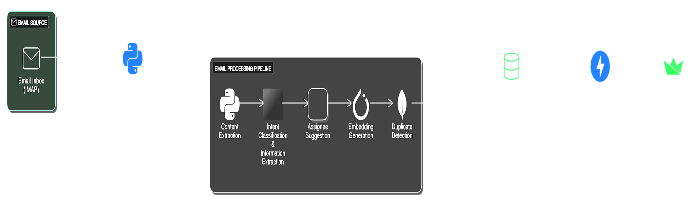

# 📧 LoanServ AI – Intelligent Email Classification & Processing System

## 1. 📝 Introduction

An AI-powered email triage system that automates the processing and classification of incoming emails for commercial bank loan servicing.

Key Features:
* Automated email content analysis and intent identification
* Smart routing to appropriate servicing teams
* Information extraction from email content and attachments
* Duplicate email detection to prevent redundant processing
* Time-saving through automated classification and prioritization
* Reduction in manual sorting errors


## 2. 🎥 Demo

[📊 View Full Presentation](artifacts/demo/Hackathon%20Deck%202025_Gaied-Data-Pioneers.ppt)




### **🔍 Sample Response**

```json
{
    "main_intent": "Dispute Incorrect Loan Charges and Payment Issues",
    "request_details": [
        {
            "intent": "Dispute Incorrect Loan Charges and Payment Issues",
            "request_type": "Payment Processing",
            "sub_request_type": "Payment Allocation",
            "customer_name": "Michael Smith",
            "email_address": "michael.smith@example.com",
            "account_user_id": "123456",
            "urgency": "Medium",
            "detailed_description": "The customer is disputing an incorrect charge on their loan statement for March 2024. The monthly installment was supposed to be $850, but they were charged $950. Additionally, an automatic payment was not deducted on the due date, resulting in a late fee.",
            "impact": "Incorrect charges and late fee applied to the loan account.",
            "steps_taken": "Customer is reaching out to customer service for clarification and resolution.",
            "attachments": [
                {
                    "filename": "Loan_Statement_March2024.pdf",
                    "description": "Loan statement for March 2024 showing discrepancies in the charged amount and a late fee."
                }
            ],
            "keywords": {
                "request_type_keywords": {
                    "payment_amount": "unavailable",
                    "payment_date": "unavailable",
                    "payment_method": "Auto-debit (Failed on Due Date)",
                    "transaction_reference_id": "unavailable"
                },
                "sub_request_type_keywords": {
                    "principal_amount": "unavailable",
                    "interest_amount": "unavailable",
                    "fee_allocation": "Late Fee: $25",
                    "escrow_adjustment": "unavailable"
                },
                "not_relevant_keywords": {}
            },
            "suggested_assignee": "Payments-Team",
            "assignment_justification": "The email reports incorrect charges and payment issues, which falls under payment processing and allocation. The attachment confirms the payment discrepancies.",
            "confidence": {
                "request_type_confidence": 95,
                "sub_request_type_confidence": 90,
                "assignment_confidence": 98
            }
        }
    ]
}
```

## 3. 💡 Inspiration

This solution was inspired by the need to streamline email processing in customer service and loan servicing departments. Specific inspiration came from:

*   **Efficiency Improvements:** Reducing the manual effort required to handle a large volume of emails.
*   **Improved Accuracy:** Minimizing errors in email classification and routing.
*   **Faster Response Times:** Enabling faster responses to customer inquiries and requests.
*   **Existing AI-Powered Solutions:** Leveraging the power of modern language models and vector search techniques for natural language processing.

## 4. ⚙️ What It Does

The Email Triage System provides the following key features:

*   **Email Fetching:** Connects to an IMAP server to retrieve unseen emails.
*   **Content Extraction:** Extracts the subject, sender, body, and attachments from emails.
*   **Text Extraction from Attachments:** Extracts text from PDF, HTML, and image attachments using libraries like PyMuPDF, BeautifulSoup, and Google Cloud Vision API, respectively.
*   **Intent Classification:** Uses a large language model (LLM) to classify the email's main intent and identify specific request details.
*   **Information Extraction:** Extracts key information from the email content, such as customer name, account ID, urgency, and relevant keywords.
*   **Assignee Suggestion:** Recommends the appropriate servicing team based on the identified intent and keywords.
*   **Embedding Generation:** Generates email embeddings using Sentence Transformers for semantic similarity search.
*   **Duplicate Detection:** Performs vector search using MongoDB Atlas Vector Search to identify near-duplicate emails based on their embeddings.
*   **Data Storage:** Stores the extracted data, classification results, and embeddings in a MongoDB database.
*   **User Interface:** Provides a basic web-based user interface (UI) to view the processed emails and their analysis results.
*	**API Endpoints**: Provides an API endpoint to fetch email records from the MongoDB database.

### **🌟 Key Features**

✅ **Automated Email Processing & Classification**  
Automatically fetches, analyzes, and categorizes incoming emails, reducing manual effort. Uses LLM-driven intent recognition (Google Gemini API via LangChain) to accurately identify primary and secondary intents.

✅ **Context-Aware Data Extraction & Attachment Handling**  
Extracts key attributes such as deal name, loan amount, and expiration date from emails and attachments. Supports various formats, including PDF, HTML, and images, using OCR via Google Cloud Vision API for comprehensive analysis.

✅ **Multi-Request Handling & Intelligent Routing**  
Processes multiple request types within a single email. Suggests the most appropriate Loan Servicing Team based on identified intent and extracted information for faster and more accurate request handling.

✅ **Intelligent Keyword Extraction & Prioritization**  
Applies hierarchy-based keyword extraction, prioritizing subject lines, attachments, and email body. Identifies missing attributes and marks them as "unavailable" while maintaining contextual accuracy.

✅ **Confidence Scoring & Justification**  
Provides classification confidence scores (0-100%) with detailed explanations and reasoning for each classification and assignment decision.

✅ **Duplicate Email Detection**  
Uses vector embeddings (Sentence Transformers) and semantic similarity search (MongoDB Atlas Vector Search) to detect duplicate or near-duplicate emails, preventing redundant processing and saving valuable time.

✅ **Modern Tech Stack & Scalable Architecture**  
Built using Python, FastAPI for the backend, and Streamlit for a user-friendly UI. Stores processed data, classifications, and embeddings in a scalable MongoDB database for future analysis.

✅ **Modular & Extensible Design**  
Leverages LangChain for a modular processing pipeline, making it easy to add or modify functionalities. Implements clear separation of concerns across API handling, email processing, embedding generation, database interaction, and UI.

✅ **Seamless API Accessibility & UI Integration**  
Provides FastAPI endpoints (/fetch\_emails/) for system integration. Features a basic Streamlit-based UI to visualize processed emails, classifications, suggested assignees, and duplicate statuses.

✅ **Secure Configuration & Continuous Monitoring**  
Manages sensitive data like API keys and database credentials via environment variables for enhanced security. Supports continuous IMAP inbox monitoring for real-time email processing.


## 5. 🛠️ How We Built It

The system was built using a combination of Python, FastAPI, Streamlit, and various libraries for natural language processing and data storage. The following methodologies and technologies were used:

*   **FastAPI:** A modern, high-performance web framework for building the backend API.
*   **Streamlit:**  A Python library used to create a simple web UI for displaying the processed emails.
*   **LangChain:** A framework for developing applications powered by language models. Used to build the email processing pipeline.
*   **Google Gemini API:** Used for classifying the intent of an email and identifying request details.
*   **Sentence Transformers:** Used to generate email embeddings for semantic similarity search.
*   **MongoDB Atlas Vector Search:** Used to store the embeddings and perform efficient vector search for duplicate detection.
*   **PyMuPDF (fitz):** Used for extracting text from PDF attachments.
*   **BeautifulSoup:** Used for parsing HTML content in emails.
*   **Google Cloud Vision API:** Used for performing OCR (Optical Character Recognition) on image attachments.
*   **IMAPlib:** Used for connecting to and fetching emails from an IMAP server.
*   **Clean Architecture:** Aimed for separation of concerns and testability.

## 6. 🤔 Challenges We Faced

During the development of this project, we encountered several challenges:

*   **Accurate Intent Classification:** Ensuring the LLM classifies email intents accurately.
*   **Extracting Text from Attachments:** Handling various attachment types for accurate text extraction.
*   **Duplicate Detection:** Efficiently identifying near-duplicate emails using vector search.
*   **Managing API Keys and Credentials:** Securely storing and accessing sensitive information.
*   **Scalability:** Enhancing the system to handle large data volumes in real-time.
*   **Error Handling and Monitoring:** Improving error management and logging capabilities.

## 7. 🚀 How to Run

Follow these steps to set up and run the project on your local machine:

1.  **Clone the Repository:**

    ```bash
    git clone <repository_url>
    cd gaied-data-pioneers
    ```

2.  **Create and Activate a Conda Environment:**

    ```bash
    conda create -n email_triage python=3.12 # or 3.11, or 3.12
    conda activate email_triage
    ```

3.  **Install Dependencies:**

    ```bash
    pip install -r requirements.txt
    ```

4.  **Configure Environment Variables:**

    *   Create a `.env` file in the root directory.
    *   Add the following variables, replacing the placeholders with your actual values:

        ```
		EMAIL_USER="your_email@gmail.com"             
		EMAIL_PASS="your_email_app_password"          
		MONGODB_USERNAME="your_mongodb_username"        
		MONGODB_PASSWORD="your_mongodb_password"       
		GOOGLE_AI_API_KEY="your_google_ai_api_key"    
		MODEL_NAME="gemini-pro"                        
		PROMPT_FILE_PATH="prompt.md"                  
		DUPLICATE_CHECK_THRESHOLD="0.9"               
		CREDENTIALS_PATH=""   

        ```

        *   **Gmail App Password:** If you're using Gmail, generate an App Password and use that for `EMAIL_PASS`.
        *   **Google AI API Key:** Obtain a Google AI API key from the Google AI Studio.
        *   **Google Cloud Vision API:** Follow the steps mentioned above to get the Google Cloud Vision API credentials JSON.

5.  **MongoDB Setup:**

    *   Create a MongoDB Atlas account and a cluster.
    *   Create a database named `email-triage`.
    *   Create a user with read and write permissions for the `email-triage` database.
    *   Create a `emails` collection in the `email-triage` database, this is where the information will be stored.
    *   Create a vector search index on the `embedding` field.  You can do this through the MongoDB Atlas UI.  The index should be of type "vector search".  You'll need to choose the appropriate settings for your embeddings (e.g., dimension, similarity metric). I'd recommend the following values:
        *   **Index Name:** email\_embedding
        *   **Database and Collection:** email-triage.emails
        *   **Field Mappings:**
                * `embedding`:  Type: `vector`, Dimensions: 384 (since you are using all-MiniLM-L6-v2, it creates 384 dimension vectors), Similarity: `cosine`

6.  **Run the Application:**

    ```bash
    uvicorn api:app --reload
    ```

    This will start both the FastAPI backend and the Streamlit frontend.

7.  **Access the UI:** Open your web browser and go to `http://127.0.0.1:8501` to access the Streamlit UI.

## 8. 💻 Tech Stack

### **🔧 Core Technologies**

*   **Programming Language:** Python
    
*   **Backend Framework:** FastAPI
    
*   **Frontend Framework:** Streamlit
    

### **🧠 Natural Language Processing (NLP)**

*   **LangChain** – Language model orchestration
    
*   **Sentence Transformers** – Text embeddings & similarity search
    
*   **Google Gemini API** – AI-powered language processing
    
*   **Gemini 2.0 Flash** – High-speed NLP model
    
*   **Hugging Face** – Pre-trained NLP models
    

### **📎 Attachment Processing**

*   **PyMuPDF (fitz)** – PDF parsing & text extraction
    
*   **BeautifulSoup** – HTML parsing & web scraping
    
*   **Google Cloud Vision API** – OCR & image-based text extraction
    

### **🗄️ Database & Vector Search**

*   **Database:** MongoDB Atlas
    
*   **Vector Search:** MongoDB Atlas Vector Search
    

### **�� Email Handling**

*   **imaplib** – Email retrieval & processing
    

### **🔨 Environment Management**

*   **Conda** – Dependency management
    
*   **dotenv** – Configuration management
    

### **💻 Supported Operating Systems**

*   **Windows**
    
*   **Linux**
    
*   **macOS**

## 9. 📈 Future Scalability

✅ **Seamless Integration with Ticketing Systems** : Automate ticket or task creation in platforms like Jira, ServiceNow, or Zendesk based on classified emails, ensuring smooth workflow integration for handling requests.

✅ **Automated Responses & Acknowledgements** : Enable automatic replies to confirm email receipt, provide relevant information, or request additional details, enhancing response times and customer experience.

✅ **Enhanced Intent Detection with Fine-Tuning** : Fine-tune the language model (e.g., Gemini Pro) on domain-specific email datasets to improve accuracy and granularity, especially for complex request types.

✅ **Sentiment Analysis for Prioritization** : Analyze email tone to detect urgency or negative sentiment, helping support teams prioritize critical cases faster.

✅ **Multilingual Support** : Expand the system's capability to process and classify emails in multiple languages using multilingual language models and adapted keyword extraction.

✅ **Personalized Routing Rules** : Allow configurable routing rules based on sender, subject keywords, or other criteria for more precise email handling within the organization.

✅ **Predictive Analytics for Workload Management** :Leverage historical email data to forecast workload patterns, enabling proactive resource allocation and queue management.

✅ **Integration with Knowledge Bases** : Connect to internal knowledge bases or FAQs to suggest relevant solutions to assignees or automatically share helpful links with senders.

✅ **Advanced Visual Analytics & Reporting Dashboard** : Develop a real-time dashboard for monitoring email volume, classification accuracy, processing times, and team workload distribution, providing actionable insights.

✅ **Support for Complex Attachment Types** :Enhance attachment handling by enabling structured data extraction from spreadsheets, presentations, and other formats beyond PDFs and images.

✅ **Continuous Improvement via Feedback Loop** :Implement a mechanism for agents to provide feedback on classification accuracy and routing, enabling continuous AI model refinement.

✅ **Proactive Issue Detection**: Train models to identify trends and patterns in incoming emails, allowing early detection of emerging issues for proactive resolution.

## 10. 👥 Team

*   **Nageswara Vejju**  
*   **Alok Shankar** 
*   **Aditya Verma** 
*   **Kaustav Das** 
*   **Abha Jaswal** 